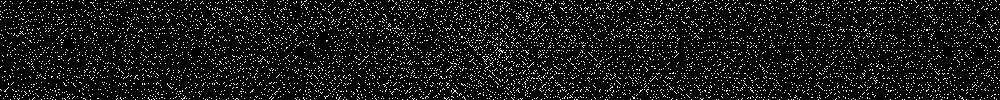

# background

Generates background images for *your* desktop.

## Examples

``./background drop 1280x128 drop.png``:


``./background wall 1280x128 wall.png``:


``./background primes 1280x128 primes.png``:


``./background random 1280x128 random.png``:


## Build

Dependencies:

- libpng
- cmake (build)

```sh
git clone https://github.com/codefionn/background
cd background
mkdir build
cd build
cmake ..
cmake --build .
./background
```

The last command prints help message.
